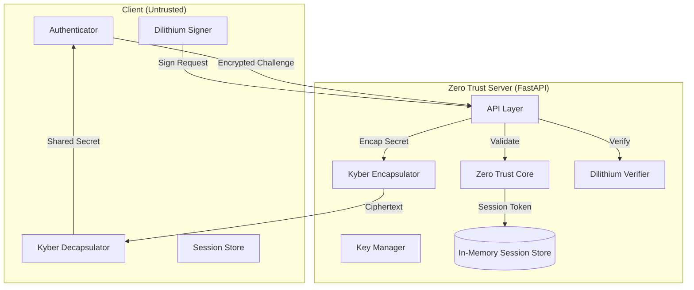
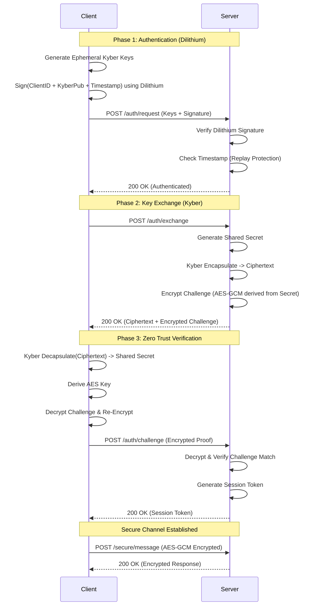
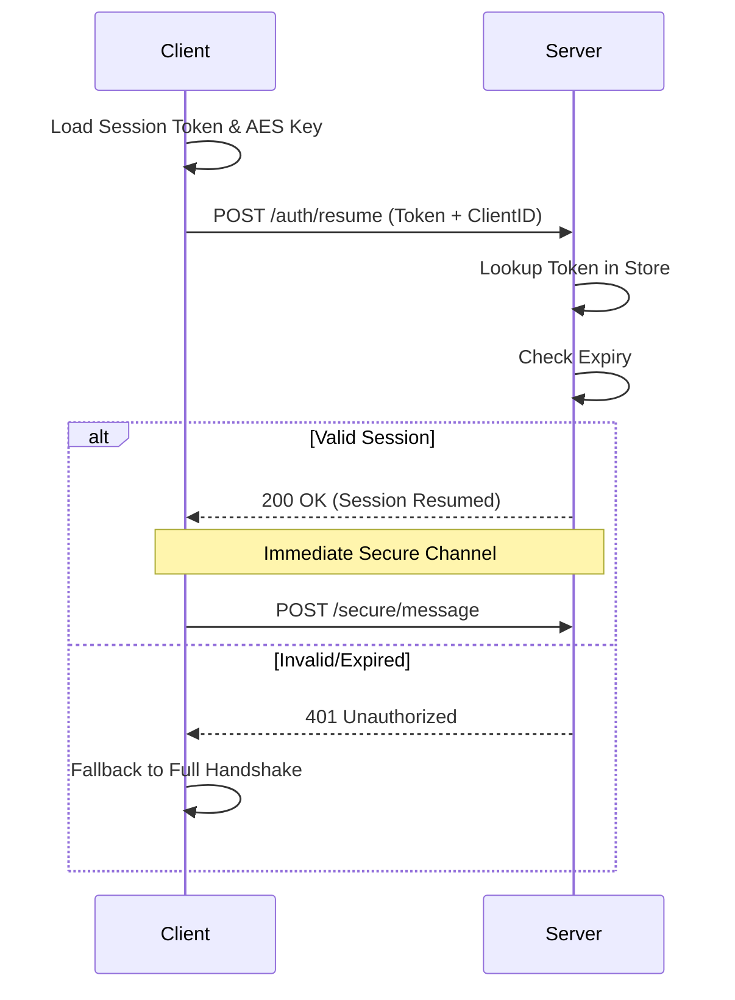

# Post-Quantum Zero Trust Architecture

## System Overview
This project implements a **Zero Trust Authentication System** secured by **Post-Quantum Cryptography (PQC)**. It uses a hybrid approach combining next-generation NIST-standard algorithms (Kyber, Dilithium) with classical symmetric encryption (AES-GCM) to ensure security against both classical and quantum threats.

The architecture is a **Client-Server** model where the server adheres to "Never Trust, Always Verify" principles.

### Key Features
- **PQC Authentication**: Identity verification using **Dilithium2** signatures.
- **PQC Key Exchange**: Secure key establishment using **Kyber512** Key Encapsulation Mechanism (KEM).
- **Zero Trust Verification**: Challenge-response mechanism to prove possession of the negotiated key before granting access.
- **Low Latency Resumption**: Session token-based resumption for fast 0-RTT-like re-connection (currently implemented in v2.0).

---

## Cryptographic Stack

| Component | Algorithm | Purpose | Implementation |
| :--- | :--- | :--- | :--- |
| **KEM** | **Kyber512** | Key Exchange / Shared Secret Establishment | `liboqs` (or simulation) |
| **Signature** | **Dilithium2** | Identity Authentication / Non-repudiation | `liboqs` (or simulation) |
| **Symmetric** | **AES-256-GCM** | Secure Channel / Data Encryption | `cryptography` (Python) |

---

## Architecture Diagrams

### 1. System Components

### 2. Full Handshake Flow (PQC Heavy)
This flow runs when a client connects for the first time or after a session expires.

### 3. Session Resumption Flow (Low Latency)
This flow is used when a valid `session_token` exists. It avoids the heavy PQC math.

## Directory Structure Analysis
- `client/`: Contains the client implementation logic.
- `server/`: Contains the FastAPI application (`main.py`) and the core logic (`zero_trust.py`).
- `crypto/`: Wrappers for PQC algorithms (`pqc_kem.py`, `pqc_signer.py`) and standard crypto (`aes_gcm.py`).
- `liboqs/`: The underlying C library binding for Post-Quantum algorithms.
